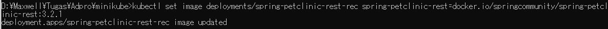

# AdvProg Module 10

## Reflection on Hello Minikube

> Compare the application logs before and after you exposed it as a Service. Try to open the app several times while the proxy into the Service is running. What do you see in the logs? Does the number of logs increase each time you open the app?

Gambar di atas merupakan kondisi logs sebelum saya mengexpose aplikasi sebagai suatu Service. Seberapa banyak saya mencoba mengakses aplikasi di port 8080, tidak pernah berhasil dan logs tetap hanya menampilkan hal yang sama.

Gambar di atas merupakan kondisi logs setelah saya mengexpose aplikasi sebagai suatu Service. Dapat dilihat bahwa terdapat 2 baris logs baru, yaitu logs GET /, yang menandakan saya berhasil mengunjungi aplikasi tersebut dengan GET request.

Gambar di atas adalah kondisi logs setelah saya mengunjungi aplikasinya kembali. Dapat dilihat bahwa logs bertambah lagi sebanyak 2 baris yang isinya sama seperti logs sebelumnya, hanya berbeda waktunya. 

> Notice that there are two versions of `kubectl get` invocation during this tutorial section. The first does not have any option, while the latter has `-n` option with value set to `kube-system`. What is the purpose of the `-n` option and why did the output not list the pods/services that you explicitly created?

Opsi `-n` pada `kubectl get` adalah opsi yang menspesifikasikan dari `namespace` mana `kubectl` harus mengambil objek yang diminta pengguna (seperti `pods` atau `service`). `namespace` disini dapat digambarkan seperti suatu folder, sehingga dengan menspesifikasikan `namespace` dengan opsi `-n`, kita memberi tahu `kubectl` dari folder mana mereka harus mengambil objek yang diminta. Secara *default*, jika tidak diberikan opsi `-n`, `namespace` yang digunakan adalah `default`.

## Reflection on Rolling Update & Kubernetes Manifest File

> What is the difference between Rolling Update and Recreate deployment strategy?

Perbedaan Rolling Update dan Recreate terdapat pada downtime yang terjadi pada aplikasi saat update sedang berlangsung. Dengan menggunakan metode Rolling Update, aplikasi dapat di update tanpa perlu adanya downtime, sehingga pengguna aplikasi kita tetap dapat menggunakan aplikasi kita tanpa harus menunggu update selesai. Di lain sisi, dengan metode Recreate, semua pods aplikasi kita akan dimatikan terlebih dahulu sebelum pods baru dibuat. Ini akan membuat aplikasi kita memiliki downtime yang dapat berlangsung dengan lama, tergantung dari apa yang kita update.

> Try deploying the Spring Petclinic REST using Recreate deployment strategy and document your attempt.

Pada awalnya, saya mereset kembali minikube dan membuat deployment, mengexpose deployment tersebut, serta meng-scale dengan 4 replika seperti layaknya tutorial.

Kemudian, saya mengikuti cara yang terdapat pada blog [ini](https://dev.to/cloudskills/kubernetes-deployment-strategy-recreate-3kgn) untuk mengubah strategy deploymentnya dari RollingUpdate menjadi Recreate

Saya mengecek apakah benar strategy sudah berubah menjadi Recreate dengan menggunakan command describe dan mencoba mengupdate image seperti di tutorial.

Terakhir, ketika dijalankan, dapat dilihat bahwa aplikasi dapat diakses seperti biasa ketika tidak sedang terjadi update.

> Prepare different manifest files for executing Recreate deployment strategy.

Saya membuat manifest files untuk strategy Recreate menggunakan command yang telah diberikan pada tutorial. File untuk deployment bernama `deployment_recreate.yaml` dan file untuk service bernama `service_recreate.yaml`.

> What do you think are the benefits of using Kubernetes manifest files? Recall your experience in deploying the app manually and compare it to your experience when deploying the same app by applying the manifest files (i.e., invoking `kubectl apply -f` command) to the cluster.

Dari pengalaman saya mencoba mendeploy aplikasi secara manual dengan menggunakan manifest file adalah dengan menggunakan manifest file, saya tidak perlu lagi mengkonfigurasi setting-setting yang saya ubah untuk deployment tersebut. Ketika saya mendeploy secara manual, banyak setting yang akan menggunakan setting default, sehingga jika saya ingin mengubahnya, saya harus mengubahnya satu per satu. Namun, dengan menggunakan manifest file, selama manifest file tersebut sudah di atur setting yang sesuai untuk aplikasi tersebut, saya tidak perlu lagi mengatur setting-setting dari aplikasi tersebut setelah mendeploy aplikasi menggunakan file manifest.
